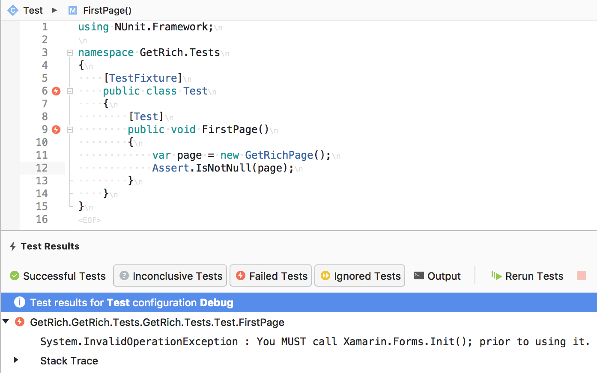

# Xamarin.Forms.Mocks
Library for running Xamarin.Forms inside of unit tests

| NuGet | Windows / AppVeyor | OS X / Travis-CI |
|---------------------------|---------------------------|-----------------------------|
| [](https://www.nuget.org/packages/Xamarin.Forms.Mocks) | [](https://ci.appveyor.com/project/jonathanpeppers/xamarin-forms-mocks) | [](https://travis-ci.org/jonathanpeppers/Xamarin.Forms.Mocks) |

If you've ever written any complicated logic inside a Xamarin.Forms View, you quickly realize that this code can't be unit tested easily. Your colleagues will tell you to MVVM all the things, but you cannot get around interacting with Xamarin.Forms itself. Things like navigation, animations, custom markup extensions, etc. can become an untested mess.

If you are determined to try it, you will probably do something like this and then give up:


You can now install [this package](https://www.nuget.org/packages/Xamarin.Forms.Mocks/) from NuGet and get past this issue:
```csharp
[SetUp]
public void SetUp()
{
    Xamarin.Forms.Mocks.MockForms.Init();
}
```

You can even do things in unit tests like load XAML dynamically:
```csharp
using Xamarin.Forms.Xaml;
//...
[Test]
public void LoadFromXaml()
{
    var label = new Label();
    label.LoadFromXaml("<Label Text=\"Woot\" />");
    Assert.AreEqual("Woot", label.Text);
}
```

You can unit test navigation:
```csharp
[Test]
public async Task Push()
{
    var root = new ContentPage();
    var page = new ContentPage();
    await root.Navigation.PushAsync(page);
    Assert.AreEqual(root.Navigation.NavigationStack.Last(), page);
}
```

You can unit test animations:
```csharp
[Test]
public async Task FadeTo()
{
    var view = new BoxView();
    await view.FadeTo(0);
    Assert.AreEqual(0, view.Opacity);
}
```

You can even unit test your markup extensions:
```csharp
public class TerribleExtension : IMarkupExtension<string>
{
    public string ProvideValue(IServiceProvider serviceProvider)
    {
        return "2016";
    }

    object IMarkupExtension.ProvideValue(IServiceProvider serviceProvider)
    {
        return ProvideValue(serviceProvider);
    }
}

[Test]
public void MarkupExtension()
{
    var label = new Label();
    label.LoadFromXaml("<Label xmlns:f=\"clr-namespace:Xamarin.Forms.Mocks.Tests;assembly=Xamarin.Forms.Mocks.Tests\" Text=\"{f:Terrible}\" />");
    Assert.AreEqual("2016", label.Text); //amirite?
}
```

You can unit test persistence of Application properties:
```csharp
[Test]
public async Task SaveAndLoad()
{
    var app = new App();
    app.Properties["Chuck"] = "Norris";
    await app.SavePropertiesAsync();

    app = new App();
    Assert.AreEqual("Norris", app.Properties["Chuck"]);
}
```

You can assert `Device.OpenUri` was called properly:
```csharp
[Test]
public void OpenUri()
{
    var expected = new Uri("https://www.google.com");
    var actual = default(Uri);

    MockForms.OpenUriAction = u => actual = u;    
    Device.OpenUri(expected);
    Assert.AreEqual(expected, actual);
}
```

You can use `Device.StartTimer` as you would expect:
```csharp
[Test]
public async Task StartTimer()
{
    var source = new TaskCompletionSource<bool>();
    Device.StartTimer(TimeSpan.FromMilliseconds(1), () =>
    {
        source.SetResult(true);
        return false;
    });

    Assert.IsTrue(await source.Task);
}
```

To test things using `Application.Current` or its resources:
```csharp
[SetUp]
public void SetUp()
{
    MockForms.Init();

    //This is your App.xaml and App.xaml.cs, which can have resources, etc.
    Application.Current = new App();
}

[TearDown]
public void TearDown()
{
    Application.Current = null;
}
```

# How does it work?

The main issue with trying to call `Xamarin.Forms.Init()` yourself for unit testing is that all kinds of interfaces and classes are marked `internal`. I get around this by conforming to `[assembly: InternalsVisibleTo]` which is declared for the purposes of unit testing Xamarin.Forms itself.

I merely named the output assembly `Xamarin.Forms.Core.UnitTests.dll`, and the `MockForms` class is able to call internal stuff all it wants. Just remember marking something `internal` does not mean someone tricky can't call it if they are determined enough.

I patterned after unit tests in Xamarin.Forms itself to figure out how to most easily mock everything.

# Notes

`Device.BeginInvokeOnMainThread` is currently just synchronous. This may not be desired, but is the quickest plan for now.

All animations will just complete immediately. Just `await` them and use `async` unit tests.

I tested everything with NUnit, but nothing is tied specifically to it. Things should work find if you want to use a different unit testing library.

# Xamarin.Forms versions

Make sure to choose the appropriate version of this package for the version of Xamarin.Forms you are using:

| Xamarin.Forms  | Xamarin.Forms.Mocks |
| -------------- | ------------------- |
| 3.5.0.x        | 3.5.0.x             |
| 3.0.0.x        | 3.0.0.x             |
| 2.5.0.x        | 2.5.0.x             |
| 2.4.0.x        | 2.4.0.x             |
| 2.3.5.x-pre    | 2.3.5.x-pre6        |
| 2.3.4.x        | 2.3.4.x             |
| 2.3.3.x        | 2.3.3.1             |
| 2.3.0-2.3.2    | 0.1.0.4             |
| Older          | Unsupported         |

As another option, you can include the source code for this project along with your unit tests. This allows you to target any version of Xamarin.Forms desired assuming there are no code changes.

# Wish List

- I am not happy with `Device.BeginInvokeOnMainThread` being synchronous.
- There are certainly other Xamarin.Forms internals not implemented. Let me know if there is something missing you need.
- I back-dated this lib to support Xamarin.Forms 2.3.x, although it may be able to go back further. It is hard to know how often the forms team changed some of these internal interfaces.
